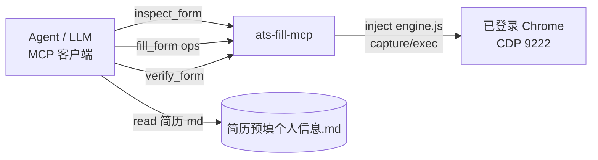

# ats-fill-mcp

通用网申表单 AI 自动填写的 **可复用 MCP 服务器**。把「Agent/LLM 做语义规划 + 页内批量执行」的混合方案固化为服务，可在任何网申站点复用，避免逐字段手工点选、也规避牛客式“几何错位”。

## 架构



- **语义层（Agent/LLM）**：调用 `inspect_form` 看结构 → 对照简历给出 `ops`（按 `msg`/`id`/`name` 寻址、值别名归一）。这正是本方案相对牛客脚本的核心优势。
- **执行层（本服务）**：页内 `engine.js` + 批量执行器：native setter + input/change、原生 select、radio/checkbox、省市两级级联下拉、日期回车、多行“增加更多”。

## 快速开始

### 1) 安装依赖
```bash
cd ats-fill-mcp
npm install
```

### 2) 启动“已登录”的 Chrome（网申站通常需要登录）
先关闭已开着的 Chrome，再带远程调试端口启动（沿用你已登录网申账号的用户目录）：
```bash
"C:\Program Files\Google\Chrome\Application\chrome.exe" --remote-debugging-port=9222
```
> 若想与日常浏览器并存，可另设 `--user-data-dir=D:\chrome-debug`，但需在其中重新登录目标网申站。

### 3) 注册到 VS Code（mcp.json / 用户设置 `mcp.servers`）
```json
{
  "servers": {
    "ats-fill": {
      "type": "stdio",
      "command": "node",
      "args": ["c:/Users/Mr.z/Desktop/release-learn/ats-fill-mcp/src/index.js"],
      "env": { "CDP_URL": "http://127.0.0.1:9222" }
    }
  }
}
```
重启 VS Code / 重载窗口后，MCP 工具即对 Copilot 可用。

## 工具与工作流

| 工具 | 说明 |
| --- | --- |
| `navigate {url}` | 打开/聚焦页面并注入引擎 |
| `inspect_form {url?}` | 采集字段：`msg` 语义名、类型、当前值、下拉选项、`增加更多` 按钮 |
| `fill_form {ops}` | 批量执行，返回每项成功/失败与回读值 |
| `verify_form {msgs}` | 回读校验（`["*"]` 全量） |

推荐工作流（Copilot 提示词可复用）：

```
1) inspect_form { url: "<网申页>" }
2) 读取简历源（如 简历预填个人信息.md），据此生成 fill_form 的 ops。
3) fill_form { ops: [ ... ] }
4) verify_form { msgs: ["姓名","民族","期望工作地点1","企业名称", ...] }
5) 由用户复核后，在页面上点“保存”。
```

## ops 参考

- 目标寻址优先级：`id` > `name` > `msg`（WinTalent/大易等表单控件带 `msg="字段语义"`，最稳）
- `{op:"text", msg:"证件号码", value:"421022200502060614"}` — 文本/textarea
- `{op:"clear", msg:"其他外语水平及成绩"}` — 清空
- `{op:"date", msg:"到岗时间", value:"2026-09-06"}`
- `{op:"select", msg:"民族", value:"汉族"}` — 原生下拉，选项文本精确→模糊匹配
- `{op:"radio", msg:"性别", label:"男"}`
- `{op:"check", msg:"同意声明", on:true}`
- `{op:"cascade", cityId:"11_245_1", provSub:"湖北", citySub:"荆州"}` — 省市两级（省级自动取 `firstLevl+cityId`）
- `{op:"addRow", text:"实习经历", times:1}` — 点“增加更多/继续添加 …”

## 注意事项 / 边界

- 本服务**不点“保存”**、**不上传附件**（照片/学籍报告/成绩单/外语证明/身份证/简历需用户本地上传）。
- 自动填入需与用户提供的真实简历一致；敏感字段（证件号等）请确保来源可靠，避免虚假申报。
- 若表单非“msg”体系：用 `id`/`name` 寻址即可；字段语义由调用方(Agent)按 `inspect_form` 的上下文判定。
- 中文 ID 以数字开头 → 内部一律用 `getElementById`/`msg` 寻址，不受 CSS 数字开头限制影响。

## 复用举例（其他站点）

拿到任意新网申页后：`inspect_form` 会输出其 `msgFields`/`addButtons`；对照简历把“实习经历、项目、教育、家庭”等字段写成 ops 即可，无需为该站写模板——语义规划由 Agent 现算，执行由本服务现跑。
